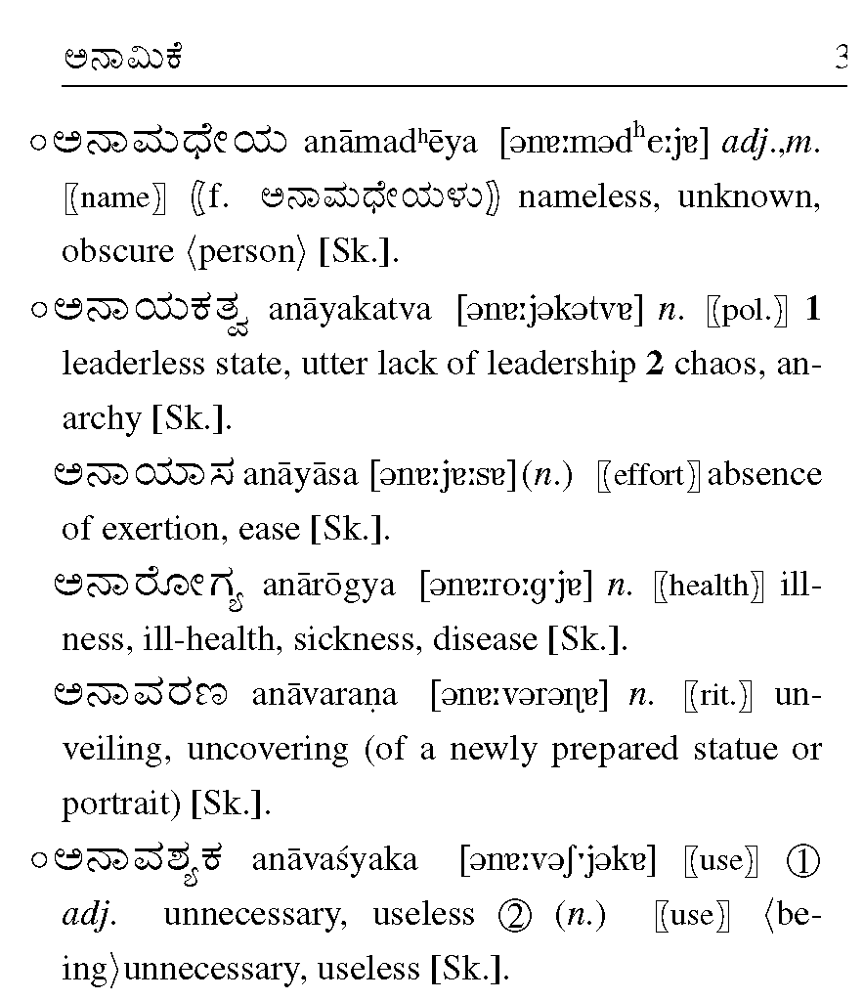
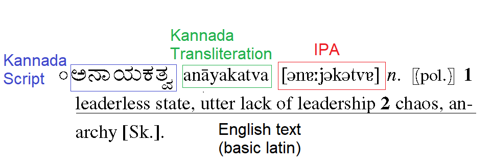

# Kannada-English dictionary OCR 

I have a pdf of an excellent Kannada-English etymological dictionary, a gem to any linguist or student studying Kannada. Unfortunately, the pdf is corrupted and therefore cannot be searched. For an Indian American trying to improve my Kannada in the year 2020, this was unacceptable! What good is an unsearchable dictionary? Surely, I couldn't be expected to scroll to the letter everytime I wanted to find a word! And thus, this project to OCR the entire dictionary was born! 


<figure align="left">
    
    <figcaption> <i>An excerpt page from the dictionary (Upper left region of pg. 188)</i> </figcaption>
</figure> 


### Challenges

At first, I tried to reconstruct the corrupted font table but quickly saw this was infeasible (if a pdf has multiple fonts, like this 1200 page pdf does, means you have to reconstruct the font table for potentially hundereds of fonts, made even more difficult by the prescence of Latin, extended Latin, and Kannada characters). 


My next best bet was OCR'ing the dictionary. And while this may sound like a trivial and easy task when the document only has one script on it, mixed language text recognition is a whole other beast altogether! 
As an example, let's look at a single dictionary entry:



Here we see there is adjacent Kannada (U+0C80-U+0CFF), Kannada Transliteration (ISO 15919), IPA (International Phonetic Alphabet - uses many different unicode blocks), and  English text (Basic Latin). That's four different adjacent scripts in one dictionary entry! This is truly a difficult problem to solve.

I decided to use Google Vision to ocr, as it is probably the most state of the art mixed language text recognition at this point, and works even for languages often neglected in OCR (such as Kannada). 

When I tried to OCR the above dictionary entry (ಅನಾಯಕತ್ವ), without providing any language hints, here was the output:
```python
//without language hints
"'o SD o anāyakatva [əne:jakatve] n. [pol.)] 1\nleaderless state, utter lack of leadership 2 chaos,\nan-\narchy [Sk.].\n'"

```
As we can see here, it hyperrecognizes Latin text (which is to be expected). 
Next, I tried providing only Kannada as a language hint:

```python
//with Kannada language hint
"'OJO AJIF3, anāyakatva [ǝne:jəkətve] n. (pol.) 1\nleaderless state, utter lack of leadership 2 chaos,\narchy [Sk.]\nan-\n'"
```

Not looking too good, even with the language hint. What could be going wrong for it to fail the Kannada text recognition so miserably? So I tried recognizing a simpler text with just Kannada and English (basic latin), meaning no ipa (or transliteration). 

<figure align="left">
    
    <figcaption> <i>mixed text with Kannada in one column and English in the other</i> </figcaption>
</figure> 

I tried the above excerpt with Kannada language hint added (no language hint failed miserably), and the results are reproduced below (I just added in the columnar formatting for easier reading).

| Left (Kannada) | Right (text) |
| ------------- | ------------- |
|ಮನೋಜ್ : ನೀವು ಬೆಳಿಗ್ಗೆ ಎಷ್ಟು | At what time do you get up in the  |
| ಗಂಟೆಗೆ ಏಳೀರಿ ?  | morning ?  |
|ಮೋಹನ್ : ಆರು ಗಂಟೆಗೆ ಏಳೀನಿ. | I get up at six o'clock.  |
| ಮನೋಜ್ : ಎದ್ದು ಏನು ಮಾಡ್ತೀರಿ ?  | After getting up, what do you do?  |
|ಮೋಹನ್ : ಎದ್ದು ವಾಕಿಂಗ್| I go for a walk. After the walk, I  |
| ಹೋಗ್ತಿನಿ. ವಾಕಿಂಗ್ | brush my teeth and I drink coffee. |
|ಹೋಗಿ ಬಂದು ಹಲ್ಲು| |
| ಉಜ್ಜಿಕೊಳ್ಳಿನಿ. ಹಲ್ಲು ||
|ಉಜ್ಜಿ ಕೊಂಡು ಕಾಫಿ| |
| ಕುಡೀತೀನಿ.| |

So it works quite well without the IPA! It must that which is screwing up my recognition!


